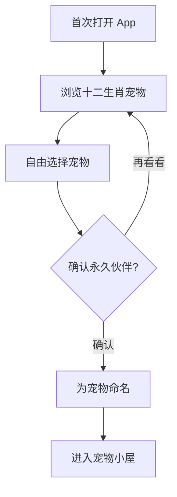
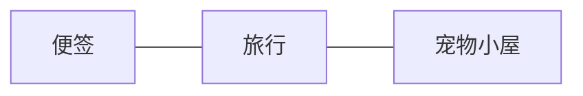
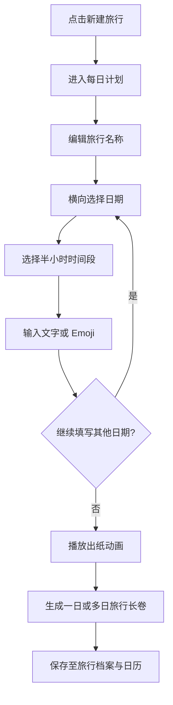
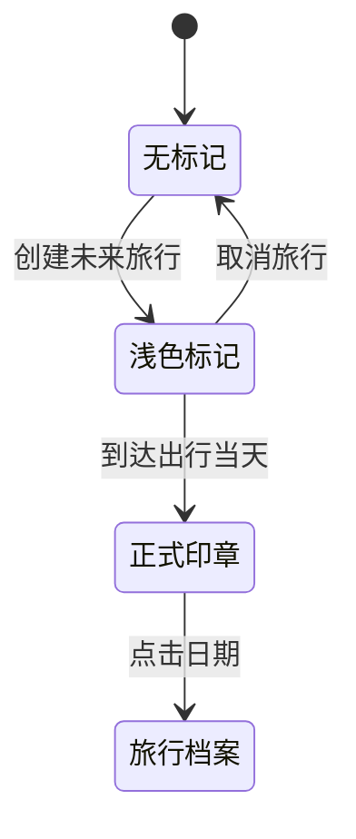
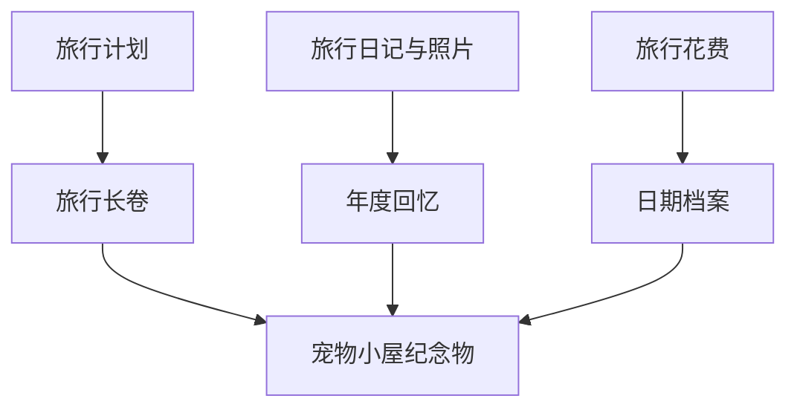

# 用户流程

## 1. 首次进入

规则：不读取生日，不推荐“用户所属生肖”；生肖伙伴不能更换，宠物名字可以修改。

## 2. 核心导航

- **便签**：记录旅行灵感和随手想法。
- **旅行**：创建时间线计划并生成旅行长卷。
- **宠物小屋**：进入日记、日历、记账、回忆和 AI 对话。

## 3. 创建旅行

## 4. 日历状态

旅行档案内展示旅行长卷、当天日记和当天花费。

## 5. 宠物小屋入口映射

| 物品 | 点击结果 |
| --- | --- |
| 桌上的日记本 | 进入旅行日记 |
| 墙上的盖章日历 | 进入我的日历 |
| 桌上的存钱罐 | 进入旅行记账 |
| 墙上的照片 | 进入年度回忆 |
| 宠物 | 进入 AI 对话 |
| 行李箱 | 选择旅行并查看旅行长卷 |
| 窗户或门 | 查看即将出发的旅行 |

## 6. 旅行结束后的记忆沉淀

